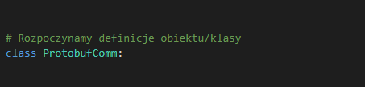
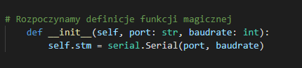
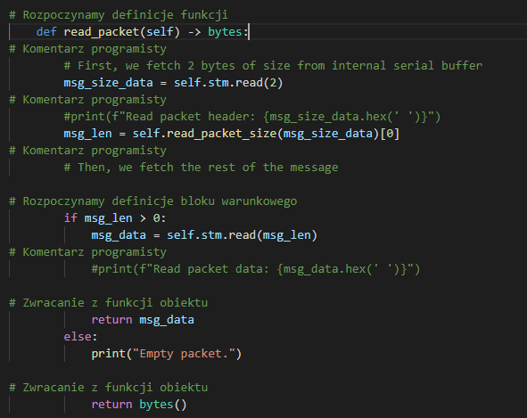
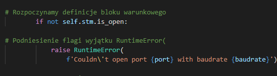
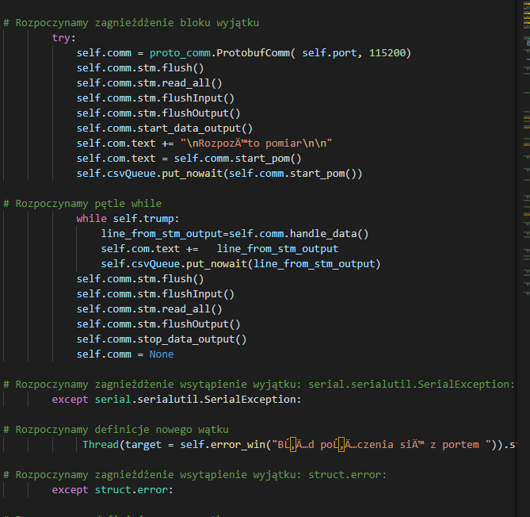
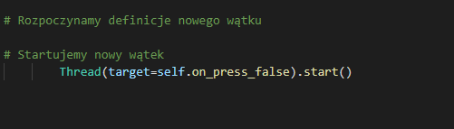
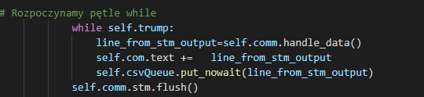
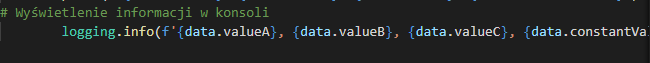

### Skład grupy:
Piotr Łach
Wojciech Maj

### Tytuł Pracy:
 "Stworzenie narzędzia do analizy leksykalnej i automatycznego dokumentowania kodu, na przykładzie języka Python"

### Cel pracy:
Wywtorzenie aplikacji: "Narzędzia do analizy leksykalnej i automatycznego dokumentowania kodu, na przykładzie języka Python". Efektem tej operacji ma być plik zawierający dokumentację pythona.
Aplikacja została wytworzona z wykorzystaniem biblioteki standardowej pythona w wersji 3.9 oraz moduł dostarczający implementacje kolejek. Całość jest rozwiązaniem autorskim. Bazuje na wyrażeniach warunkowych, które odpowiednie wysterowują treść komentarza. Plik wynikiowy jest połączeniem źródła kodu oraz wygenerowanych komentarzy. 

### Pojęcia:
 * klasa(słowo kluczowe class) - kontener na zminne oraz fukcje(metody) służące określonym zadaniom charakterystyczym dla posiadanych  właściwości
 * obiekt - reprezentacja klasy, zmienna mająca typ klasy.
 * funkcja(metody) - opis czynności wykonywanych na zmiennych/elementach środowiska(dostęp do konsoli) w celu uzyskania  założonego rezultatu
 * operatory (+/ - %) - elementy o charakterze funkcyjnym, będącymi symbolową reprezentają bazowych operacji matematycznych, bądź przeciążeń w ramach klasy.
 * wątki(threads) - reprezentacja współbieżnie wykonowanego procesu. Pozwala na zarządzanie zasobami oraz kontrolą nad  wykonywaniem całości aplikacji, w celu uzyskania optymalnego czasu działania.
 * typy złożone - typy zawierające typy proste/bądź złożone np.: listy.
 * typy proste(float,char,int) - typy elementarne.
 * zmienne - element tworzony bądź/i wykorzystywany w aplikacji posiądający określony, bądź dedukowany typ
 * operator '=' - służy jako operacja przypisania wartości/obiektu, do zmiennej/klasy.
 * operator '#' - określenie obszaru komentarzy, niewykorzstywana część aplikacji, jedna linia
 * operator ' """{...}""" ' - określenie obszaru komentarzy, niewykorzstywana część aplikacji, obszar pomiędzy znakami ' """ '
 * def - słowo rozpoczynające definiowanie funkcji/metody
 * import - funckja załączająca paczkę/plik/moduł
 * _funkcja\_ - oznaczenie dla specjalnych funkcji
*  return - słowo kluczowe zwracające zmienną, będącą wynikiem działania funkcji/metody.
*  {} - oznaczenie na słownik, bądź zestaw
*  klucz wartość w słowniku - symbolizowane jako {"klucz":"wartość",...,"klucz":"wartość"}
*  () - oznaczenie dla tupli
*  tupla - obiekt przechowujące elementy
*  [] - lista
*  zmienna w liście - [el1,el2...eln]
*  zmienne w zestawie - {el1,el2...eln}
*  zestaw - zbiór niemodyfikowalnych zmiennych
*  : - następna linia może zawierać wcięcie 
*  pętle - narzędzie iteracji


### Zawartość projeku

1. Plik 'Documentation_generator_for_Python.py'
   W tym pliku znajduje się kod wykonawczy narzędzia będącego tematem projektu. Poszczególne części kodu zostały przedstawione w sekcji :"Prezentacja działania kodu"
2. Plik 'proto_comm.py'
   Plik z roszerzeniem języka Python poddawany analizie i automatycznemu dokumentowaniu jego zawartości. Poszczególne fragmenty kodu poddawane analizie zostały przedstawione w sekcji:"Prezentacja działania kodu"
3. Plik 'file.py'
   Plik z roszerzeniem języka Python poddawany analizie i automatycznemu dokumentowaniu jego zawartości. Poszczególne fragmenty kodu poddawane analizie zostały przedstawione w sekcji:"Prezentacja działania kodu" 
4. Pliki 'proto_documentation[1-2].py'
   Pliki będące wynikiem działania aplikacji, która jest tematem projektu.
5. Pliki 'file_documentation_1.py'
   Pliki będące wynikiem działania aplikacji, która jest tematem projektu.


#### Prezentacja działania kodu 


```python

if line.find('from ') != -1 :
    file_write.put_nowait('\n# Importujemy z biblioteki '+dataarray[1]+' metodę/klasę o nazwie: '+dataarray[3]+'\n')
else:
    if line.find('import') != -1:
        file_write.put_nowait('\n#  importujemy biblioteke o nazwie: '+dataarray[1]+'\n')
```


Oto przykład wykonania powyższego kodu, który szuka określonych nazw składniowych 
'import' i 'from'. 

```py
if dataarray[0] == 'class':
    file_write.put_nowait('\n# Rozpoczynamy definicje obiektu/klasy\n')
```


Przykład zamieszczenie komentarzy odnośnego pojawienia się definicji klasy

```py    
if dataarray[0] == 'def':
    str_line = '\n# Rozpoczynamy definicje funkcji'
    i = str(line).count("__")
    if "__" in line:
        if i == 2:
            print("licznik: "+str(i))
            str_line +=' magicznej'
            file_write.put_nowait('\n'+str_line+'\n')


if "#" in dataarray[0]:
                file_write.put_nowait('# Komentarz programisty\n')
```
Powyższa funkcja jest odpowiedzialna za dodawanie komentarzy odnośnych definicji funkcji a także funkcji tzw. magicznych (np. \__init__ , \__call__ )





Zaprezentowano także dodanie komentarzy generowanych do komentarzy programisty 


```py
    if dataarray[0] == 'if':
        file_write.put_nowait('\n# Rozpoczynamy definicje bloku warunkowego\n')

    if "raise" in line:
        file_write.put_nowait('\n# Podniesienie flagi wyjątku '+dataarray[1]+'\n')
        
```


Przykład dodania komentarza dla bloku warunkowego a także dodanie komentarza dla flagi __raise__ 

```py
if dataarray[0] == 'try:':
    file_write.put_nowait('\n# Rozpoczynamy zagnieżdżenie bloku wyjątku\n')

if dataarray[0] == 'except':
    file_write.put_nowait('\n# Rozpoczynamy zagnieżdżenie wsytąpienie wyjątku: '+dataarray[1]+'\n')
            
```

Prezentacja przykładu dodania komentarza odnoszącego się definicji zadeklarowania bloku try i except.


```py

if "Thread" in dataarray[0]:
    file_write.put_nowait('\n# Rozpoczynamy definicje nowego wątku\n')

if "threading" in line:
    file_write.put_nowait('\n# Rozpoczynamy definicje nowego wątku\n')
            
if "threading.Timer" in line:
    file_write.put_nowait('#  Określenie wątku, który wykona daną metodę w określonym czasie \n')

if ".start()" in dataarray[0]:
    file_write.put_nowait('\n# Startujemy nowy wątek\n')
```



```py 
if "for" in dataarray[0]:
    file_write.put_nowait('\n# Rozpoczynamy pętle for \n')
```
```py
if "while" in dataarray[0] :
    file_write.put_nowait('\n# Rozpoczynamy pętle while\n')
```



```py
if "return" in dataarray[0]:
    file_write.put_nowait('\n# Zwracanie z funkcji obiektu\n')
```


```py
if "logging." in dataarray[0]:
    file_write.put_nowait('\n# Wyświetlenie informacji w konsoli\n')
```


Komentarz odnośnie występowanie tzw. Loggów, które są odpowiedzialne za wypisanie w konsoli informacji, lepiej widocznych niż tych z wykorzystniem funkcji print.
Dodatkowo można wyświetlić logging.error, który podświetlany jest na czerwono co znacznie pomaga z zauważeniem.

