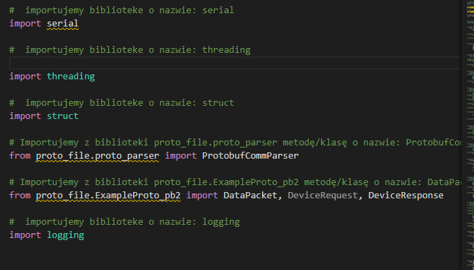
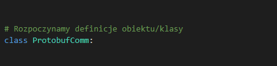
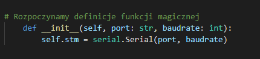
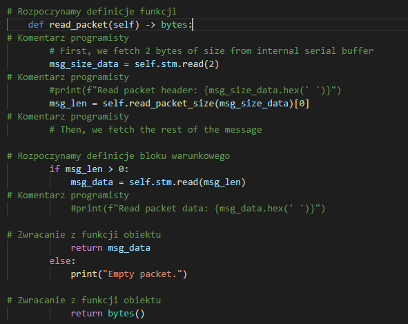
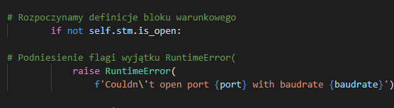
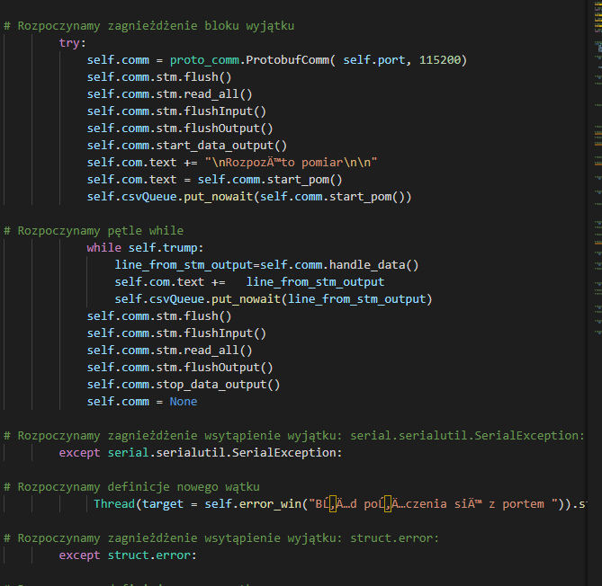
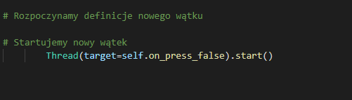
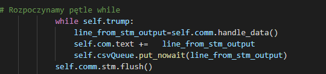
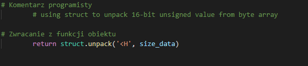
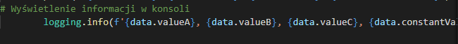

### Skład grupy:
Piotr Łach
Wojciech Maj

### Cel pracy:
Wywtorzenie aplikacji, która będzie parsować kod Pythona i wytwarzać do niego komentarze. Efektem tej operacji ma być plik zawierający dokumentację pythona.

### Pojęcia:
 * klasa(słowo kluczowe class) - kontener na zminne oraz fukcje(metody) służące określonym zadaniom charakterystyczym dla posiadanych  właściwości
 * obiekt - reprezentacja klasy, zmienna mająca typ klasy.
 * funkcja(metody) - opis czynności wykonywanych na zmiennych/elementach środowiska(dostęp do konsoli) w celu uzyskania  założonego rezultatu
 * operatory (+/ - %) - elementy o charakterze funkcyjnym, będącymi symbolową reprezentają bazowych operacji matematycznych, bądź przeciążeń w ramach klasy.
 * wątki(threads) - reprezentacja współbieżnie wykonowanego procesu. Pozwala na zarządzanie zasobami oraz kontrolą nad  wykonywaniem całości aplikacji, w celu uzyskania optymalnego czasu działania.
 * typy złożone - typy zawierające typy proste/bądź złożone np.: listy.
 * typy proste(float,char,int) - typy elementarne.
 * zmienne - element tworzony bądź/i wykorzystywany w aplikacji posiądający określony, bądź dedukowany typ
 * operator '=' - służy jako operacja przypisania wartości/obiektu, do zmiennej/klasy.
 * operator '#' - określenie obszaru komentarzy, niewykorzstywana część aplikacji, jedna linia
 * operator ' """{...}""" ' - określenie obszaru komentarzy, niewykorzstywana część aplikacji, obszar pomiędzy znakami ' """ '
 * def - słowo rozpoczynające definiowanie funkcji/metody
 * import - funckja załączająca paczkę/plik/moduł
 * _funkcja\_ - oznaczenie dla specjalnych funkcji
*  return - słowo kluczowe zwracające zmienną, będącą wynikiem działania funkcji/metody.
*  {} - oznaczenie na słownik, bądź zestaw
*  klucz wartość w słowniku - symbolizowane jako {"klucz":"wartość",...,"klucz":"wartość"}
*  () - oznaczenie dla tupli
*  tupla - obiekt przechowujące elementy
*  [] - lista
*  zmienna w liście - [el1,el2...eln]
*  zmienne w zestawie - {el1,el2...eln}
*  zestaw - zbiór niemodyfikowalnych zmiennych
*  : - następna linia może zawierać wcięcie 
*  pętle - narzędzie iteracji

### Plan pracy:

Plan pracy:
1. Wywtorzenie funkcji do otwierania i zamykania pliku wynikowego.
2. Wytworzenie funkcji dla aplikacji, które będą dokumentować proste funckje.
3. Wytworzenie funkcji do dokumentowania pętli.
4. Wytworzenie funkcji do dokumentowania warunków.
5. Wytworzenie funkcji do dokumentowania wątków.
6. Wytworzenie funkcji do dokumentowania zmiennych.
7. Wytworzenie funkcji do dokumentowania klas.


```python

if line.find('from ') != -1 :
    file_write.put_nowait('\n# Importujemy z biblioteki '+dataarray[1]+' metodę/klasę o nazwie: '+dataarray[3]+'\n')
else:
    if line.find('import') != -1:
        file_write.put_nowait('\n#  importujemy biblioteke o nazwie: '+dataarray[1]+'\n')
```


Oto przykład wykonania powyższego kodu, który szuka określonych nazw składniowych 
'import' i 'from'. 

```py
if dataarray[0] == 'class':
    file_write.put_nowait('\n# Rozpoczynamy definicje obiektu/klasy\n')
```


Przykład zamieszczenie komentarzy odnośnego pojawienia się definicji klasy

```py    
if dataarray[0] == 'def':
    str_line = '\n# Rozpoczynamy definicje funkcji'
    i = str(line).count("__")
    if "__" in line:
        if i == 2:
            print("licznik: "+str(i))
            str_line +=' magicznej'
            file_write.put_nowait('\n'+str_line+'\n')


if "#" in dataarray[0]:
                file_write.put_nowait('# Komentarz programisty\n')
```
Powyższa funkcja jest odpowiedzialna za dodawanie komentarzy odnośnych definicji funkcji a także funkcji tzw. magicznych (np. \__init__ , \__call__ )





Zaprezentowano także dodanie komentarzy odnośnych komentarzy programisty 


```py
    if dataarray[0] == 'if':
        file_write.put_nowait('\n# Rozpoczynamy definicje bloku warunkowego\n')

    if "raise" in line:
        file_write.put_nowait('\n# Podniesienie flagi wyjątku '+dataarray[1]+'\n')
        
```


Przykład dodania komentarza dla bloku warunkowego a także dodanie komentarza dla flagi __raise__ 

```py
if dataarray[0] == 'try:':
    file_write.put_nowait('\n# Rozpoczynamy zagnieżdżenie bloku wyjątku\n')

if dataarray[0] == 'except':
    file_write.put_nowait('\n# Rozpoczynamy zagnieżdżenie wsytąpienie wyjątku: '+dataarray[1]+'\n')
            
```

Prezentacja przykładu dodania komentarza odnoszącego się definicji zadeklarowania bloku try i except.


```py

if "Thread" in dataarray[0]:
    file_write.put_nowait('\n# Rozpoczynamy definicje nowego wątku\n')

if "threading" in line:
    file_write.put_nowait('\n# Rozpoczynamy definicje nowego wątku\n')
            
if "threading.Timer" in line:
    file_write.put_nowait('#  Określenie wątku, który wykona daną metodę w określonym czasie \n')

if ".start()" in dataarray[0]:
    file_write.put_nowait('\n# Startujemy nowy wątek\n')
```



```py 
if "for" in dataarray[0]:
    file_write.put_nowait('\n# Rozpoczynamy pętle for \n')
```
```py
if "while" in dataarray[0] :
    file_write.put_nowait('\n# Rozpoczynamy pętle while\n')
```



```py
if "return" in dataarray[0]:
    file_write.put_nowait('\n# Zwracanie z funkcji obiektu\n')
```



```py
if "logging." in dataarray[0]:
    file_write.put_nowait('\n# Wyświetlenie informacji w konsoli\n')
```


Komentarz odnośny wystąpnienia tzw. Loggów, które są odpowiedzialne za wyrzucenie w konsoli dannej, są przez to lepiej widoczne niż zwykły print.
Dodatkowo można wyświetlić logging.error, który podświetlany jest na czerwono co znacznie pomaga z zauważeniem.